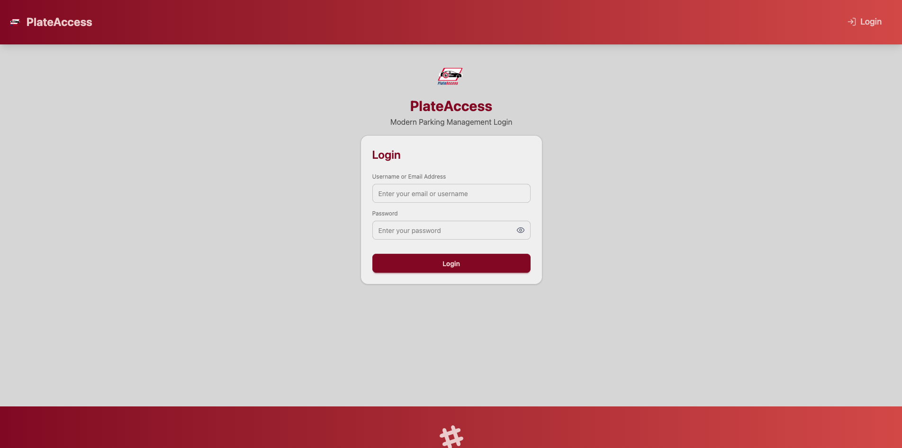
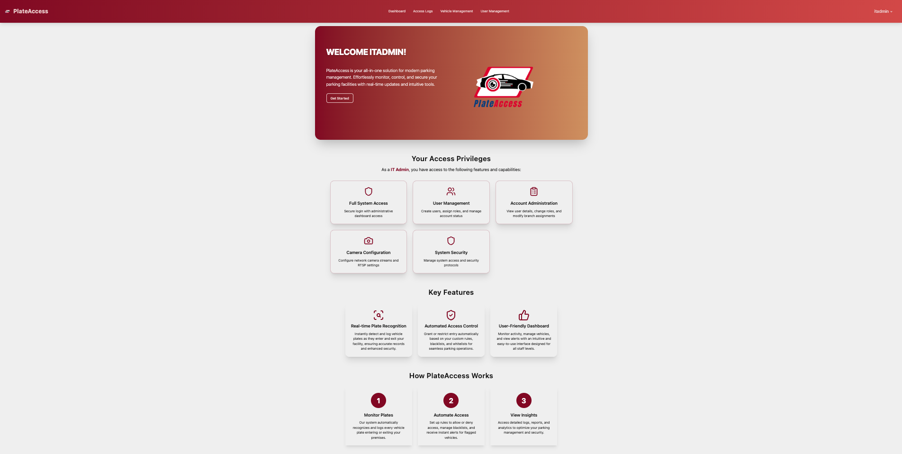
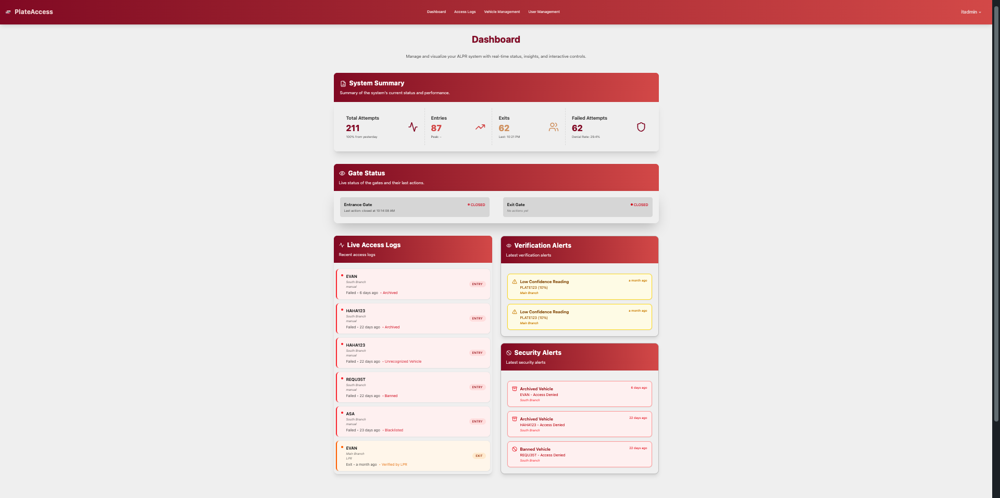
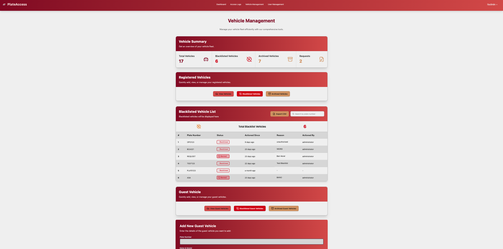
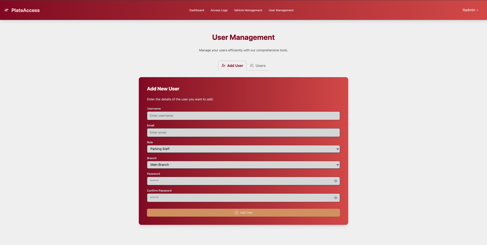
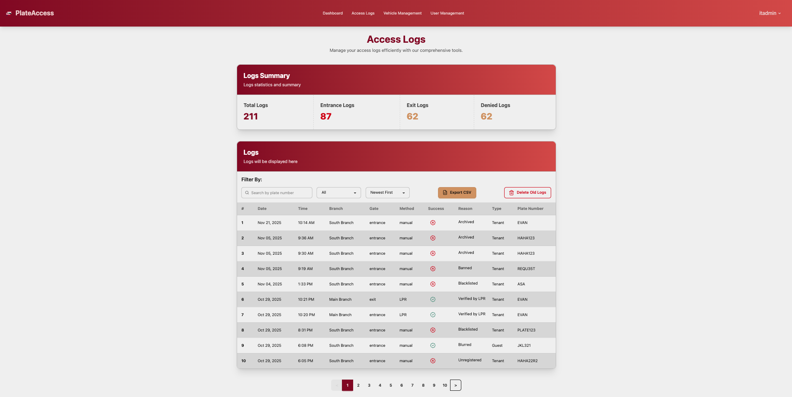
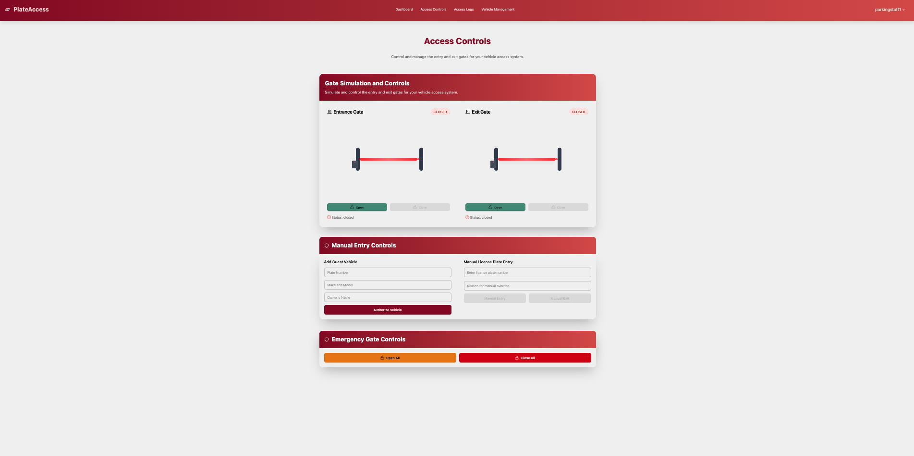
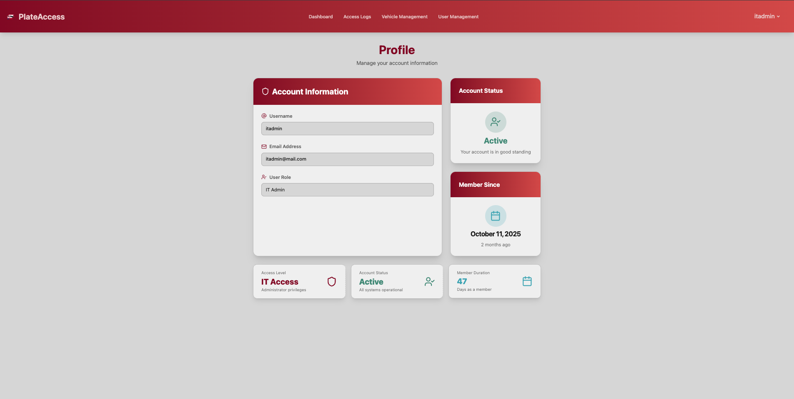

# PlateAccess

A Web-based License Plate Recognition System with Automated Access Control for Residential and Workplace Parking

> **Disclaimer:** The live demo includes the web interface only.  
> License Plate Recognition (LPR) and archival cold storage are not included.  
> Manual plate entry can be used to test without physical cameras.

🔗 [Live Demo](https://plate-access.onrender.com/)  

---

## Users & Roles

- **IT Administrator:** Manage users, branches, logs, and system settings  
- **Administrator:** Register vehicles, approve requests, manage blacklist, view logs  
- **Parking Staff:** Handle guest vehicles, entry/exit logs, manual plate entry  
- **Residents/Employees:** Authorized automatic entry, vehicle registration via staff  

---

## Key Features

- JWT-based authentication & role-based access control  
- Real-time vehicle registration and management  
- Manual plate entry fallback  
- Automated gate control simulation  
- Real-time notifications via Socket.IO  
- Comprehensive logging and reporting  
- Cross-platform responsive design  

---

## Tech Stack

- **Frontend:** React.js, Tailwind CSS, DaisyUI, Socket.IO Client  
- **Backend:** Node.js, Express.js, MongoDB, Socket.IO Server, JWT  
- **Deployment:** Render  

---

## Screenshots

  
  
  
  
  
  
  
  

---

## Authors

**Bryan Harold R. Suguitan** | **Sage Evan T. Vilaga** | **Alliah Chantalle Cabiao**  
*Mapúa University - Makati, School of Information Technology*  

---

## Contact

- GitHub: [@brynsgtn](https://github.com/brynsgtn)  
- Portfolio: [brynsgtn-webportfolio.vercel.app](https://brynsgtn-webportfolio.vercel.app/)  
- Email: *[your-email@example.com]*  

**Repository:** [github.com/yourusername/plateaccess](https://github.com/yourusername/plateaccess)  

---

## Citation
